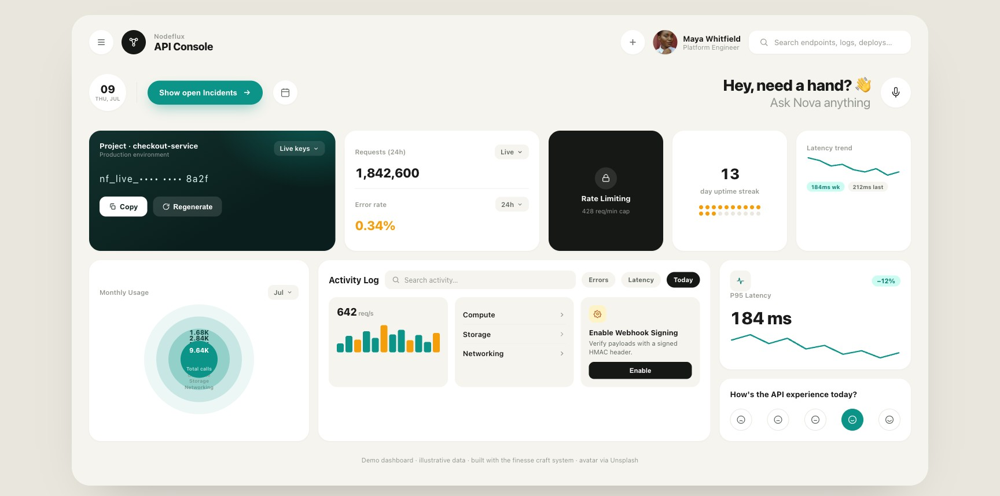
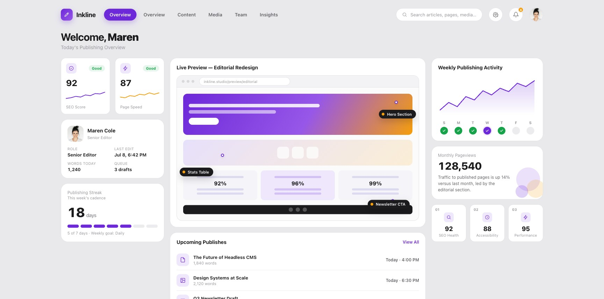
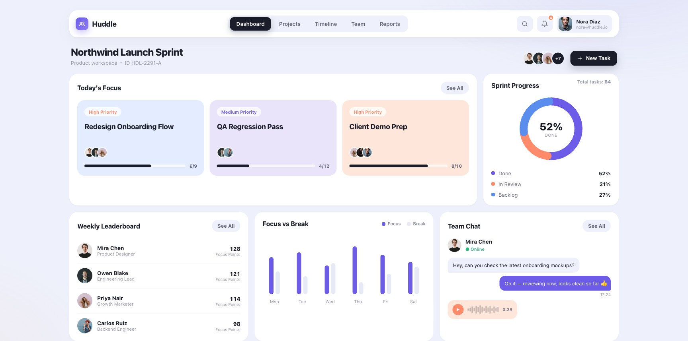
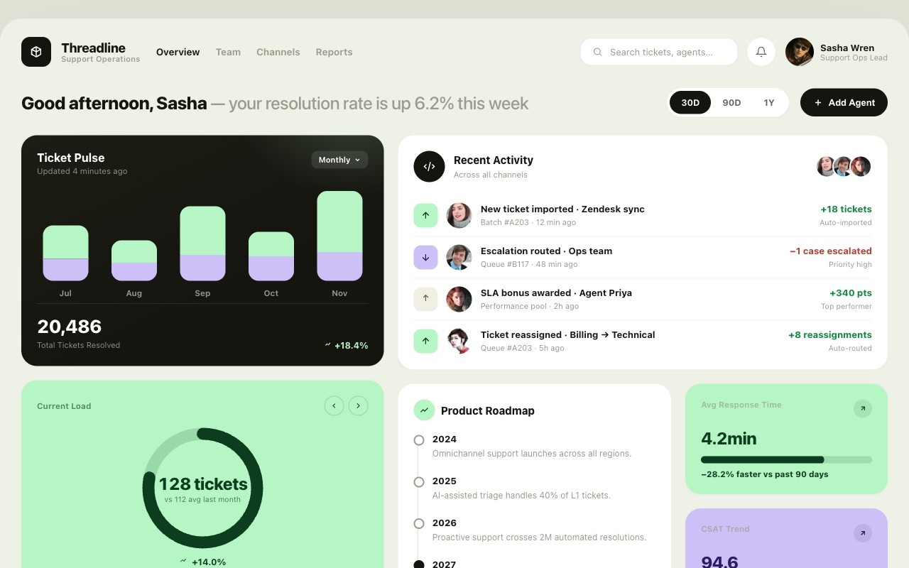

[中文](README.md) | [English](README.en.md)


# finesse-skill

> **绝不廉价的高级界面 —— 品牌惊艳 + 产品精密**
> A design skill for building never-cheap, high-craft web interfaces — both brand surfaces and product UI.

`finesse` 是一个给 AI 编码助手（Claude Code / Codex 等）用的设计技能。它按 **register** 分两条路：

- **brand**（设计即产品）—— 落地页 / 品牌站 / 发布页 / 作品集 / 行业 hero 页。追求 **惊艳 + 灵魂 + 第一印象**，拥抱真正的视觉引擎（Three.js / GLSL / Canvas / WebGL / GSAP）。
- **product**（设计服务产品）—— 仪表盘 / 后台 / analytics / 数据表 / app shell / 设置。追求 **清晰 + 密度 + 可用性**，组件系统 + 数据可视化。

两条路共享同一底色：**高级感物理层 + 反廉价审查**。仪表盘也不许长得廉价。

## 它怎么工作

1. **先读 brief**（register：brand vs product）→ 输出一句 Design Read，定方向。
2. **拧三个旋钮**：SOUL · SPECTACLE（招牌）· DENSITY。product 模式 SPECTACLE 压低、DENSITY 拉高。
3. **两路共用**：铺高级感物理层（grain · vignette · 字重张力 · 半透明边框 · OKLCH 色彩锁定）。
4. **分流**：
   - **brand** → 选灵魂（行业→风格人格）+ 造一个 hero 引擎（五类选一，100% 做透）。
   - **product** → 组件系统 + 数据可视化（信息架构 · 表格 · 图表 · 表单 · 交互状态全集）。
5. **反廉价黑名单 + 起飞前自检**，再交付。

> 第一次用？看 **[使用清单 USAGE.md](USAGE.md)**——没有设计经验也能照着用好。

## 核心能力

- **高级感物理层** — grain 噪点 / vignette 暗角 / 字重张力 / 配色家族（提炼自 53 页行业展示页语料）
- **五类 hero 视觉引擎** — Three.js / Canvas / WebGL-FBO / GSAP / CSS-only，各含 reduced-motion 降级骨架
- **3D 效果谱系** — CSS 伪 3D（指针倾斜卡 / 翻转卡 / coverflow / 景深视差）+ Three.js 真 3D（模型查看器 / 图片扭曲平面），`depth` 命令一键加一个 3D 时刻
- **行业灵魂决策矩阵** — 行业 → 风格 / 配色 / 字体 / 引擎 的选型表，专治"千页一面"
- **product UI 路线** — 仪表盘信息架构 · 25 种图表选型 · 数据表 · 表单 · 交互状态全集 · 组件系统 · 认知负载
- **register 驱动** — brand vs product 分流，两套完全不同的设计规则
- **反廉价黑名单** — 经生产验证的 AI tells + 绝对禁区 + reflex-reject 字体/配色清单
- **design-model token 锁定** — 多页一致性 + 生成 → 自检 → 迭代闭环
- **OKLCH 配色策略阶梯** — restrained / committed / full / drenched 四档承诺

## 示例作品

出自同一设计基因的页面 —— brand 路线（视觉引擎 · 灵魂驱动）多行业覆盖：

| | |
|:---:|:---:|
|  |  |
|  |  |
|  |  |

product 路线（组件系统 · 数据可视化 · 信息架构）：

| | |
|:---:|:---:|
|  |  |
|  |  |
|  |  |
|  |  |

## 安装 & 工具支持

### npx skills（推荐 · 一条命令通用于 Claude Code / Codex / Cursor 等）

[`npx skills`](https://github.com/vercel-labs/skills) 是 Vercel Labs 出的开源跨工具 skill 安装器，运行时会让你选择装到哪个 agent。

```bash
# 安装全部 skill
npx skills add https://github.com/mouse-lin/finesse-skill

# 只安装某个 skill
npx skills add https://github.com/mouse-lin/finesse-skill --skill "finesse-ui"
```

安装后在对话里说"用 finesse 做一个 …"或 `/finesse` 即可触发。

### Cursor

把 `.cursor/rules/finesse-ui.mdc` 复制到你的项目的 `.cursor/rules/` 目录：

```bash
cp .cursor/rules/finesse-ui.mdc your-project/.cursor/rules/
```

Cursor 在你编辑 HTML / CSS / JS / TS / Vue / Svelte 文件时会自动加载这条规则。

### OpenAI Codex

把 `AGENTS.md` 复制到你的项目根目录，Codex 会自动读取并遵循 finesse 工作流：

```bash
cp AGENTS.md your-project/AGENTS.md
```

或直接把 `skills/finesse-ui/SKILL.md` 的内容粘贴进 Codex 对话。

### GitHub Copilot

把 `.github/copilot-instructions.md` 复制到你的项目的 `.github/` 目录：

```bash
cp .github/copilot-instructions.md your-project/.github/
```

Copilot 会自动读取并以 finesse 标准生成代码。

### Trae

把 `.trae/skills/finesse-ui/`（完整目录，含 SKILL.md + references + examples + scripts）复制到你的项目：

```bash
cp -r .trae/skills/finesse-ui your-project/.trae/skills/
# 国内版 Trae 用 .trae-cn，同样是完整目录：
cp -r .trae-cn/skills/finesse-ui your-project/.trae-cn/skills/
```

和 Claude Code 一样是完整镜像（不是精简版）——Trae 的 Skills 目录结构（`.trae/skills/<name>/SKILL.md`）与 Claude Code 原生一致，能按需加载全部 reference 文件，所以直接复制整个目录即可拿到完整深度。**维护提醒**：`skills/finesse-ui/` 有任何改动，都要同步复制到 `.trae/skills/finesse-ui/` 和 `.trae-cn/skills/finesse-ui/`，这两份是独立静态拷贝，不会自动跟着更新。

### CodeBuddy

把 `.codebuddy/skills/finesse-ui/`（完整目录，含 SKILL.md + references + examples + scripts）复制到你的项目：

```bash
cp -r .codebuddy/skills/finesse-ui your-project/.codebuddy/skills/
```

同样是完整镜像——CodeBuddy 的 Skills 目录结构（`.codebuddy/skills/<name>/SKILL.md`）与 Claude Code 原生一致。**维护提醒**：`skills/finesse-ui/` 有任何改动，都要同步复制到 `.codebuddy/skills/finesse-ui/`，这是一份独立静态拷贝，不会自动跟着更新。

### 任何其他工具（ChatGPT / API 直调 等）

把 `skills/finesse-ui/SKILL.md` 的内容粘贴进 system prompt 或第一条消息即可，无需安装。

---

## 仓库结构

```
finesse-skill/
├── skills/
│   └── finesse-ui/
│       ├── SKILL.md                      # 主入口：方法论 + 流程
│       ├── references/
│       │   ├── design-dna.md             # 高级感物理层（配色/字体/grain/vignette）
│       │   ├── hero-engines.md           # 五类视觉引擎骨架 + reduced-motion + inline-image 技法
│       │   ├── 3d-effects.md             # 3D 效果谱系：CSS 伪 3D（倾斜/翻转/coverflow/景深）+ Three.js 真 3D
│       │   ├── style-personas.md         # 行业→灵魂 决策矩阵
│       │   ├── anti-cheap.md             # 反廉价黑名单（AI tells + 禁区 + reflex-reject）
│       │   ├── product-ui.md             # product 路线：仪表盘/表格/图表/表单/状态/组件
│       │   ├── dataviz.md                # 图表决策矩阵：25 种类型 × a11y 分级 × 库推荐
│       │   ├── commerce-ui.md            # 电商路线：PDP/PLP/购物车/结算 + 暗黑模式黑名单
│       │   ├── asset-sourcing.md         # 无素材时的取图决策：生图/真实图库/占位兜底 + 授权节点
│       │   ├── preflight.md              # 起飞前自检清单（含战略遗漏清单）
│       │   ├── redesign-mode.md          # 改造模式：审计优先 + 六步改造协议
│       │   ├── design-model.md           # 多页一致性的 token 锁定模板
│       │   └── inspiration-catalog.md    # 53 页语料中另外 48 页的技法索引（按 persona 分组，不含源文件）
│       └── examples/
│           ├── EXAMPLES.md               # 5 个正例对应的 persona/engine
│           └── *.html                    # 真实 showcase 页（只读参考）
├── .claude-plugin/plugin.json            # Claude Code 原生插件
├── .cursor/rules/finesse-ui.mdc          # Cursor 规则（精简单文件，自动加载）
├── AGENTS.md                             # OpenAI Codex 指令
├── .github/copilot-instructions.md       # GitHub Copilot 指令（精简单文件）
├── .trae/skills/finesse-ui/              # Trae（完整镜像，与 skills/finesse-ui 同深度，需手动同步）
├── .trae-cn/skills/finesse-ui/           # Trae 国内版（同上，完整镜像）
├── README.md
└── LICENSE
```

## 范围之外

finesse 同时覆盖 brand 和 product UI，范围很宽。只有这两种情况不适合：**纯后端 / API / 无界面的数据任务**，或明确要求"无个性、零打磨"的页面（finesse 总会带上工艺；真要平庸是另一种工具）。

## License

MIT
